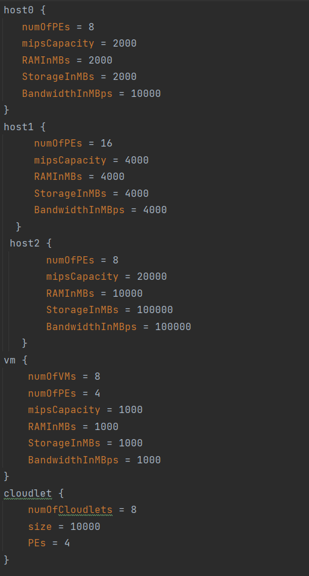
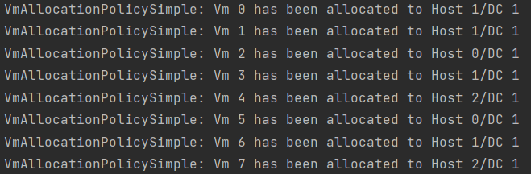
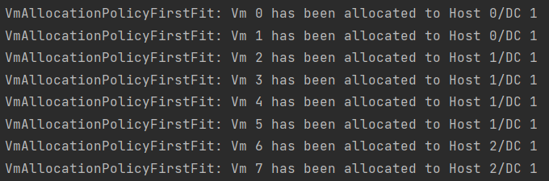
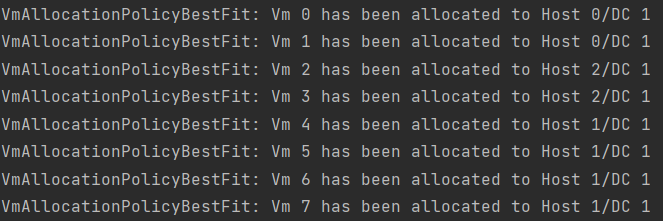
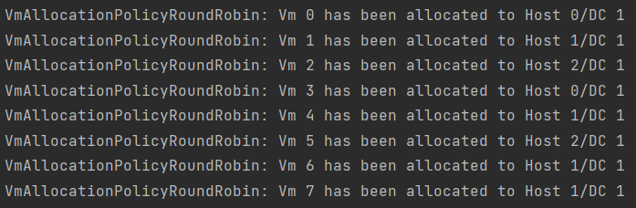
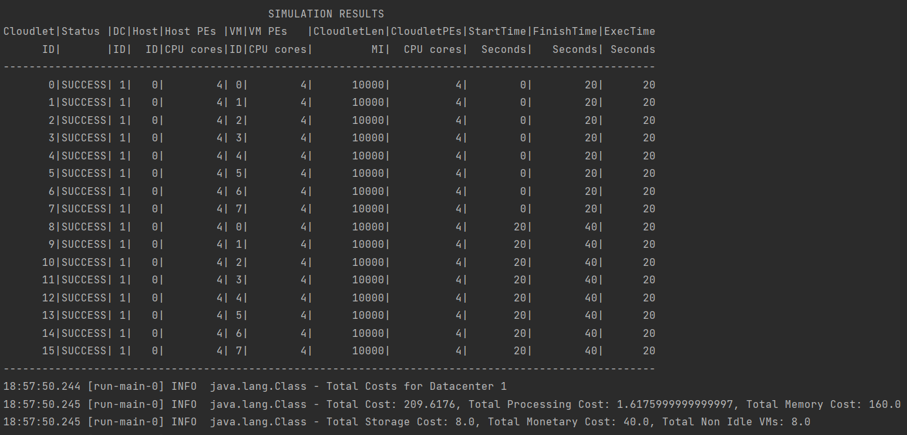
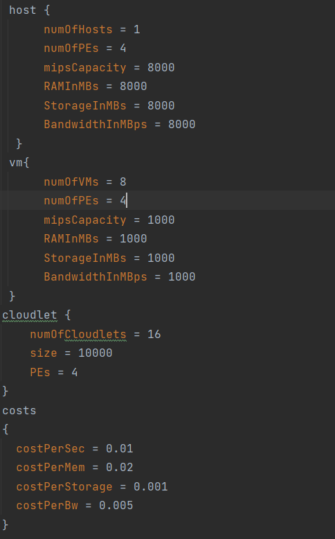

The first 4 simulations that are run, differ in the vm allocation policy. Based on the results it is shown how each 
policy allocated vms to their respective hosts. All 4 simulations are ran using this config file, which has 3 different 
hosts with different specifications:

Next I will show the differences in how vms are allocated between hosts:

Simple Vm Allocation Policy

First Fit Allocation Policy

Best Fit Allocation Policy

Round Robin Allocation Policy

The simple policy allocates vms based on the fewest PEs in use. So it allocates vms into host with 
the most available PEs. So the vm0 and vm1 are put into host1 since host1 has 16 PEs. So now host1 
has 8 PEs left since each vm needs 4 PEs.

Now, vm2 is allocated into host0 because it also has 8 PEs so the policy will choose the first host 
if the number of available PEs are the same between hosts. Next, host1 is chosen again since it has 
8 PEs left, and it comes before host2 which also has 8PEs left, while host0 has 4PEs left. This policy
will continue to pick host with most available PEs until all vms have been allocated as can be seen 
by the first picture. 

The first fit allocation policy allocates vms to the first host it sees that can fit the vm. It 
will try to fit as many vm as it can into each host before moving on to the next host. This can be 
seen in the second picture as it picks hosts in order. Host0 and host2 can fit 2 vms each and Host1
can fit 4vms.

The best fit policy chooses hosts based on the must number of PEs in use. So it will choose host0 
first fill it up, then it will choose host2 because it has 8 fewer PEs then host1. Finally, it will
pick host 1 and fill it up. 

The round-robin policy chooses hosts in circular way. In the picture you can see vm be allocated 
to host0->host1->host2 then back to host0->host1->host2. Since host0 and host2 are now full the 
last two vms are put in host1. 

These 4 simulations use the same config file and are organized in the same way. The only differnece 
is the vm allocation policy. So these simulations are a great way to see the differences between
each policy.

Next simulation is organization that has a Time Shared Vm Scheduler and Cloudlet Space Shared 
Scheduler:

This simulation uses this config specifications: 

Looking at the specifications we are only running one host with 4 Physical PEs while 
having 8 vms each needing 4 virtual PEs. Using the Time Share Vm Scheduler we are able
to share the physical PEs with all VMs as long as the total mip capacity required by the vms 
is less than the mip capacity of our physical PEs. Looking at the config file we see that each 
of our physical PEs has 8000 mips while each vm requires 1000 mips. Meaning that each of our 
physical PEs can share its mips with all 8 vms. Without this scheduler each of the virtual PEs would 
have to be assigned to its own physical PE. Meaning our physical PE would be under utilized since 7000
potential mips will not be used. Also, without this scheduler our simulation would fail since 
there would not be enough hosts for all the vms. 

This simulation would also has a space shared 
