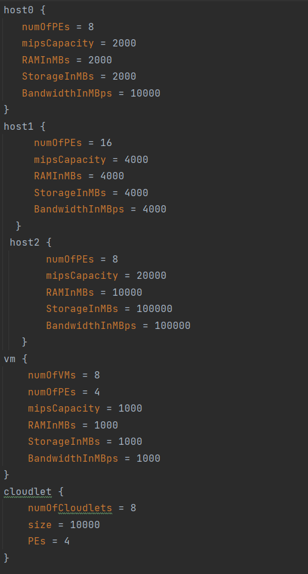
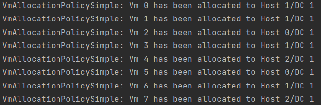
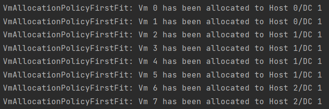
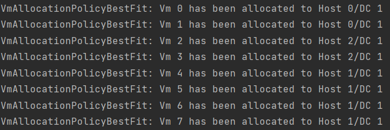
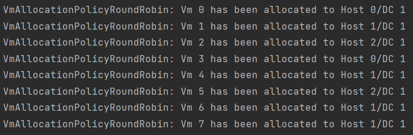
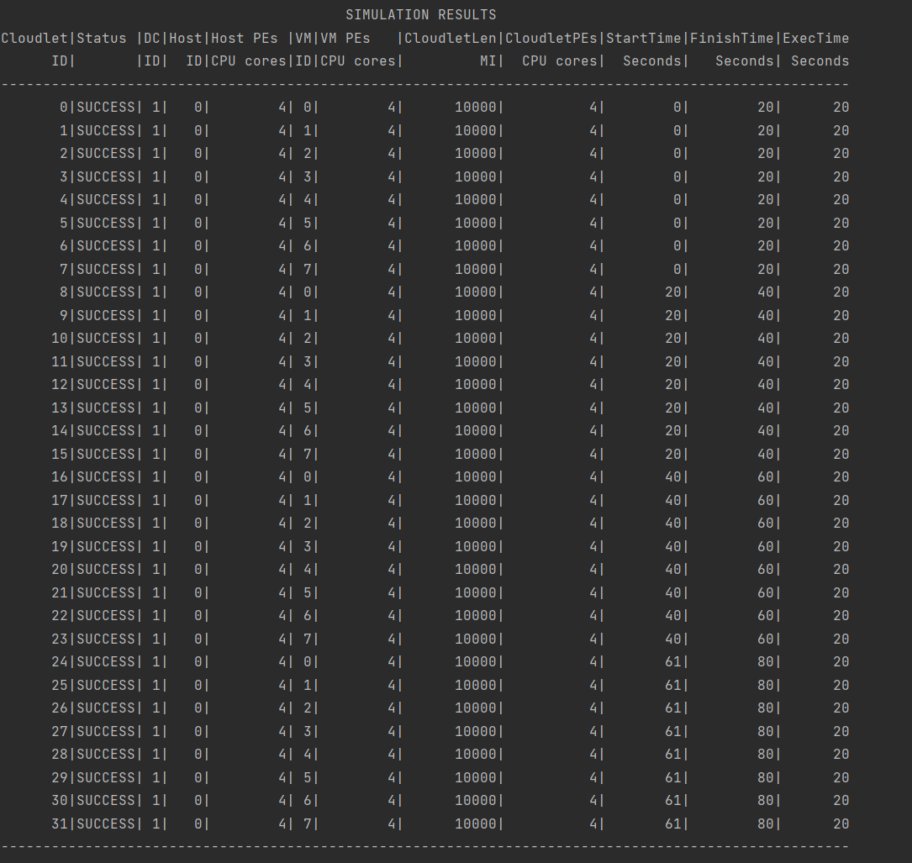
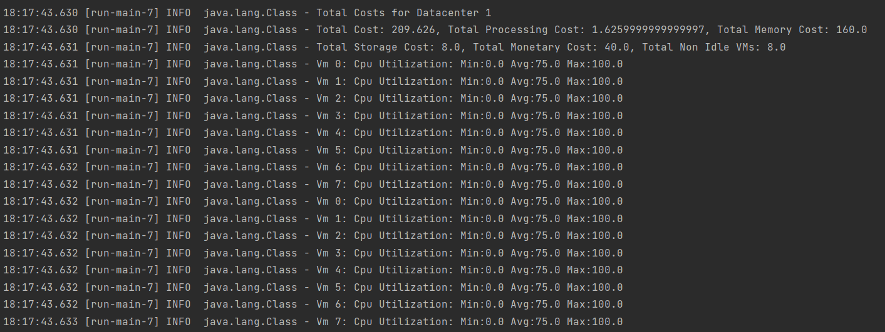
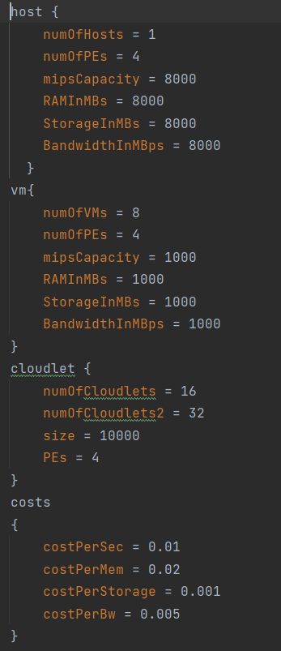
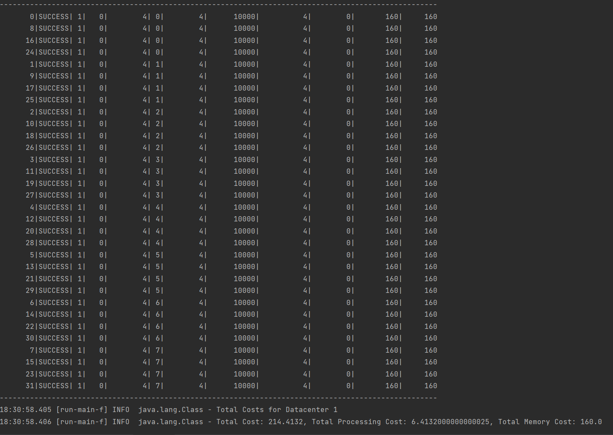
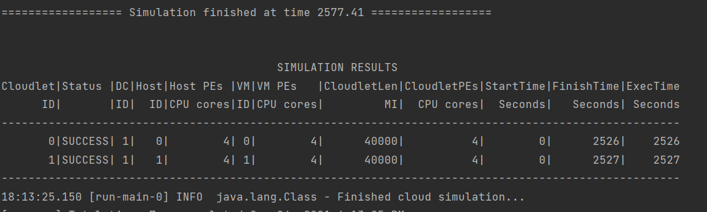

##Name: Sebastian Greczek##
##Email: sgrecz3@uic.edu##
##Instructions##
Load repo into intellij. Make sure you have the cloudSim Plus external libraries.
* sbt clean compile run - to run simulations
* sbt clean compile test - to run tests
#Overview#
These simulation can be broken down into three categories:
* Vm Allocation Poilcy comparison (4 Simulations).
* Cloudlet Scheduler: Time-Shared vs Space-Shared (2 Simulations).
* BroadCast Storm (1 Simulation).

###Config File Breakdown###
Three different utilization ratio are specified
* Ratio0: Used by vm Allocation Policies. 
* Ratio1: Used by cloudlet Time-Shared Policy
* Ratio2: Used by cloudlet Space-Shared Policy

4 different host configurations
* host0, host1, host2: Used by vm Allocation Policies Simulations.
* host: Used by Time-Shared and Space-Shared simulations.
* netHost: Used by broadcast strom simulation. 

2 Vm configurations
* vm: Used all simulations except broadcast storm
* netVms: Used by broadcast storm simulation

Cloudlet config used by all simualtions

Cost config used by all simulations to set costs of runninng simulations.

Network configs used by broadcast storm simulation

###File Breakdown###
scala/HelperUtils/Utils.scala: This file holds basic cloudSim functions used by all 
simulations except broadcast storm. These functions create the basic components of each simulation
such as datacenters, hosts, vms, cloudlets, etc. More detail information can be seen in the comments 
functions. 

scale/simulations/*: These are the simulations files that hold the start function called by 
scala/simulations.scala
* vmAllocationsSim.scala: By the passing in the vmAllocation policy in the start function, you can compare
different policies using the same exact organization and specifications.
* cloudletSpaceSharedScheduler.scala: Time shared vm Allocation with cloudlet space shared Scheduler using the 
configurations specified in the config breakdown. 
* timeSharedScheduler: Time shared vm Allocation with cloudlet time shared shared Scheduler using the
  configurations specified in the config breakdown.
* broadcastStormSim: Simulation that creates a broadcast storm between its components.

Further simulation details will shown below. 

#Simulations#
###Vm Allocation Policy Simulations###
The first 4 simulations that are run, differ in the vm allocation policy. Based on the results it is shown how each 
policy allocated vms to their respective hosts. All 4 simulations are ran using this config file, which has 3 different 
hosts with different specifications:

Next I will show the differences in how vms are allocated between hosts:

##Simple Vm Allocation Policy##

##First Fit Allocation Policy##

##Best Fit Allocation Policy##

##Round Robin Allocation Policy##

The simple policy allocates vms based on the fewest PEs in use. So it allocates vms into host with 
the most available PEs. So the vm0 and vm1 are put into host1 since host1 has 16 PEs. So now host1 
has 8 PEs left since each vm needs 4 PEs.

Now, vm2 is allocated into host0 because it also has 8 PEs so the policy will choose the first host 
if the number of available PEs are the same between hosts. Next, host1 is chosen again since it has 
8 PEs left, and it comes before host2 which also has 8PEs left, while host0 has 4PEs left. This policy
will continue to pick host with most available PEs until all vms have been allocated as can be seen 
by the first picture. 

The first fit allocation policy allocates vms to the first host it sees that can fit the vm. It 
will try to fit as many vm as it can into each host before moving on to the next host. This can be 
seen in the second picture as it picks hosts in order. Host0 and host2 can fit 2 vms each and Host1
can fit 4vms.

The best fit policy chooses hosts based on the must number of PEs in use. So it will choose host0 
first fill it up, then it will choose host2 because it has 8 fewer PEs then host1. Finally, it will
pick host 1 and fill it up. 

The round-robin policy chooses hosts in circular way. In the picture you can see vm be allocated 
to host0->host1->host2 then back to host0->host1->host2. Since host0 and host2 are now full the 
last two vms are put in host1. 

These 4 simulations use the same config file and are organized in the same way. The only differnece 
is the vm allocation policy. So these simulations are a great way to see the differences between
each policy.

Next simulation is organization that has a Time Shared Vm Scheduler and Cloudlet Space Shared 
Scheduler:

###Coudlet Space Shared Scheduler Simulation###

###config specifications:### 

Looking at the specifications we are only running one host with 4 Physical PEs while 
having 8 vms each needing 4 virtual PEs. Using the Time Share Vm Scheduler we are able
to share the physical PEs with all VMs as long as the total mip capacity required by the vms 
is less than the mip capacity of our physical PEs. Looking at the config file we see that each 
of our physical PEs has 8000 mips while each vm requires 1000 mips. Meaning that each of our 
physical PEs can share its mips with all 8 vms. Without this scheduler each of the virtual PEs would 
have to be assigned to its own physical PE. Meaning our physical PE would be under utilized since 7000
potential mips will not be used. Also, without this scheduler our simulation would fail since 
there would not be enough hosts for all the vms. 

This simulation also uses a space shared scheduler for the cloudlets. From the config file you 
will see that there is 32 cloudlet. Also the utilization ratio is set to 100%. So at any given time
there can only be 8 cloudlets executing. So what do we do with the other cloudlets?

The space shared scheduler requires that each vm only has one cloudlet and puts all other cloudlets 
in a waiting list. This is why the utilization rate should be at 100% as each vm will not have 
any other jobs. The cloudlets do have to wait for a cpu to become available but data transfer happens
as soon as cloudlets are submitted.

Form my simulations, my vms only had an average utilization of 75%, min of 0%, and max 100%. My speculation 
is that it takes some time for a waiting cloudlet to be accepted by the cpu, so there might be some time, where the 
cpu is idle, in my case about 25% of the time. So this scheduler will not utilize the cpu fully.

Now lets take a look at a cloudlet time-shared scheduler for the same config values:

###Cloudlet Time Shared Simulation###

This scheduler assumes that there is no cloudlets waiting so we must bring the utilization rate down to 
25%, so we won't have to put the waiting cloudlets in virtual memory drastically increasing our processing time. 
This scheduler will use our vm cpus at a constant 25% rather than having the cpu usage going from 0 to 100% like
in the space shared scheduler. Looking at the cost calculations this scheduler does increase our processing time 
about 6x over space shared but this scheduler does guarantee our cloudlets finish at the same time. If processing time
is all we care about the space shared scheduler is better. 

##BroadcastStorm##
###Simulation Results###

In this simulation we try to simulate a broadcast storm by sending messages to all components 
of our system to slow down the computation of our cloudless. First we set up a networked system by 
creating Network datacenters, hosts, vms, and cloudlets. We connected a switch to each host and connect
all the switches to the datacenter. Next we create packets and send them to everything in a short amount of 
time. We bounce back our tasks between the two cloudlets and we send host packets between the two hosts. 
We also send ICMP packets between the two switches. This considerably slows down our simulation. These two
cloudlets should take a few seconds to complete but in our simulation they took 25000 seconds. 

